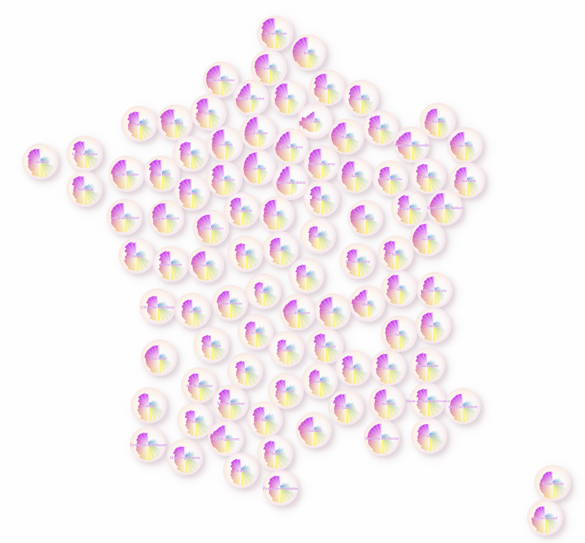

# r-osaces

Le script `r-osaces.R` permet de réaliser des cartes sous forme de rosaces où chaque pétale représente une variable.

Sur la carte ci-dessus, les tranches d'âge sont représentées pour chaque département.

J'avais écrit [un article](https://datagistips.hypotheses.org/15) pour parler de ce mode de représentation et de la conception de cette carte.

# Néo-rétro

Émile Cheysson, en 1881, avait réalisé une carte similaire sur le mouvement quinquennal.

## Quick start
Pour ouvrir la carte, ouvrez le fichier `dataviz.qgs` dans QGIS.

Le script `r-osaces.R` est entièrement reproductible. Vous pourrez l'adapter en fonction de vos données. 

Le fichier `fonctions.R` contient les fonctions R permettant de réaliser les polygones représentant les pétales et rosaces.

La librairie `packcircles` est utilisée pour les cartogrammes de cercles, et le script intègre quelques éléments rudimentaires de trigonométrie pour faire les rosaces.